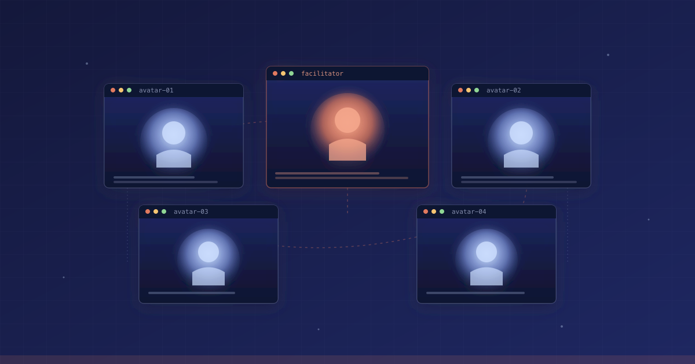

<p align="center">
  
</p>

<h1 align="center">Persona Studio</h1>

<p align="center">
  <strong>내일 회의를 오늘 미리 돌려보세요. 실제로 그 자리에 있을 사람들의 AI 아바타와 함께.</strong>
</p>

<p align="center">
  <a href="#빠른-시작"><strong>빠른 시작</strong></a> &middot;
  <a href="#뭘-할-수-있나"><strong>사용 예시</strong></a> &middot;
  <a href="#커맨드-목록"><strong>커맨드</strong></a> &middot;
  <a href="#자주-묻는-질문"><strong>FAQ</strong></a> &middot;
  <a href="README.md"><strong>English</strong></a>
</p>

<p align="center">
  <a href="./LICENSE"></a>
  
  
  
  
  
</p>

<br/>

## 이게 뭐야?

# 내일 미팅이 불안해? 오늘 미리 돌려봐. 그 자리에 올 사람 전부랑.

**면접**이 있는데 처음 보는 세 사람이 면접관이세요? 그 사람들 LinkedIn과 팟캐스트 에피소드를 Persona Studio에 넣으세요. 면접 전날 밤, 그들이 실제로 던질 질문을 — 그들 목소리로 — 몇 번이고 들어볼 수 있습니다.

**팀 미팅**에서 팀장·PM·늘 반대하는 엔지니어한테 아이디어를 피칭해야 하나요? 세 사람의 Slack 메시지와 지난 분기 All-Hands 녹음으로 아바타를 만드세요. 피칭해보세요. 그들끼리 서로 끊고 반박하는 걸 보세요. 피칭 다듬고, 다시 돌려보세요.

Persona Studio는 **Claude Code 플러그인**으로, 실제 사람의 공개/사적 자료를 그 사람처럼 말하는 AI 아바타로 변환합니다. 여러 아바타가 각자 터미널 pane에서 동시에 대화해요. 코드 한 줄 안 써요. `/persona-studio:studio` → 화살표 키 → 끝.

<br/>

## 뭘 할 수 있나?

<table>
<tr>
<td valign="top" width="26%"><strong>면접 준비</strong><br/><sub>가장 흔한 유스케이스</sub></td>
<td>
3일 뒤 패널 면접이 있나요? 면접관들의 LinkedIn · 팟캐스트 에피소드 · 블로그 글을 폴더 하나에 넣으세요. Persona Studio가 아바타 3개를 만듭니다 — 채용 매니저, 시니어 엔지니어, 문화 적합성 면접관. 세 명이 동시에 각자 터미널 pane에서 모의 면접을 진행합니다.
<br/><br/>
그들은 실제로 할 질문을 던집니다. 당신 답변에 반응합니다. 당신이 적합한지 서로 의견이 갈립니다. 당신이 쩔쩔맨 모든 질문이 담긴 Word transcript와 면접관별 스코어카드 PowerPoint가 나옵니다. 내일 밤 피드백 반영해서 또 돌리고, 또 돌리세요 — 면접 당일에는 어떤 어려운 질문도 이미 40번 들어본 상태.
</td>
</tr>
<tr>
<td valign="top"><strong>팀 미팅 리허설</strong></td>
<td>내일 팀장·PM·늘 반대하는 엔지니어한테 아이디어 피칭. 세 사람 Slack 메시지와 지난 분기 All-Hands 녹음으로 아바타 제작. 피칭. 그들끼리 반박하는 걸 관찰. 약점 수정. 실제 미팅 때는 반박이 어디서 나올지 이미 알고 입장.</td>
</tr>
<tr>
<td valign="top"><strong>똑똑한 친구들과 브레인스토밍</strong></td>
<td>밤 11시에 문제에 막혔는데 물어볼 사람은 다 자고 있나요? 당신이 신뢰하는 thinker 3명 — 팔로우하는 창업자, 대학 교수, 블로그 자주 보는 시니어 엔지니어 — 의 아바타를 열어 한 방에 앉히세요. 문제를 테이블에 올리고, 그들이 완전히 다른 각도에서 파고들게 하세요. 관점 간 마찰이 혼자서는 도달 못할 아이디어를 드러냅니다. 레포에 <code>paul_graham</code>·<code>naval_ravikant</code>·<code>dhh</code>가 이미 들어있으니 이들부터 시도해보세요.</td>
</tr>
<tr>
<td valign="top"><strong>어려운 대화 연습</strong></td>
<td>성과 평가, 연봉 협상, 클라이언트 이별, 팀원에게 쓴소리. 상대방의 이메일·과거 1:1 노트로 아바타 제작. 대화를 미리 돌려보고 예상 반응 확인. 접근법 조정.</td>
</tr>
<tr>
<td valign="top"><strong>이해관계자 스트레스 테스트</strong></td>
<td>CEO·CFO·개발총괄 아바타 제작 (보드 덱·All-Hands 녹음). 제안 던지고 그들끼리 반박·수용하게 놔두기. 모든 반대 의견이 담긴 Word 문서 + 살아남은 액션 아이템 PowerPoint.</td>
</tr>
<tr>
<td valign="top"><strong>현실감 있는 대사 쓰기</strong></td>
<td>소설가·시나리오 작가: 캐릭터 백스토리로 아바타 만들고, 플롯 포인트 토론시키기. transcript를 1차 초고 대사로. 서로 다른 "목소리" 간의 마찰이 캐릭터를 살립니다.</td>
</tr>
</table>

<br/>

## 누구한테 좋나?

- **면접 보는 사람** — 패널 면접이 킬러 유스케이스. 면접관 아바타를 만들고, 밤새 리허설하고, 당일 침착하게 입장.
- **중요한 미팅 앞둔 직장인** — 팀장·PM·늘 반대하는 엔지니어한테 피칭해야 할 때. 반박이 어디서 나올지 미리 알고 시작하세요.
- **어려운 대화 미루는 사람** — 성과 평가, 연봉 협상, 클라이언트와의 이별, 팀원에게 쓴소리. 실제 대화 전에 상대방 예상 반응 리허설.
- **창업자·PM** — 이해관계자 미팅, 투자자 피칭, 고객 통화. 둘 이상의 목소리가 중요한 자리 전부.
- **작가·시나리오 작가** — 캐릭터들이 서로 겉도는 대화가 아니라 서로 맞부딪히는 대사. 마찰이 핵심.
- **Claude Code 개발자** — Agent Teams + Ralph loop + split-panes의 실사용 레퍼런스.

**웹 브라우저 쓸 줄 알고 터미널에 커맨드 몇 줄 칠 수 있으면 쓸 수 있어요.**

<br/>

## 빠른 시작

### 1단계 — Claude Code 설치 (5분)

공식 가이드: <https://docs.claude.com/en/docs/claude-code/quickstart>

Claude 계정이 필요합니다. macOS·Linux·Windows(WSL)에서 작동.

### 2단계 — tmux 설치 (2분)

**tmux**는 여러 터미널 창을 한 화면에 나눠주는 도구예요. 아바타들이 "동시에 말하는 것처럼 보이게" 하는 데 꼭 필요합니다.

```bash
# macOS
brew install tmux

# Ubuntu / Debian / WSL
sudo apt install tmux
```

### 3단계 — Persona Studio 내려받기 (1분)

```bash
git clone https://github.com/zirubak/persona-studio.git
cd persona-studio
claude --teammate-mode split-panes
```

마지막 줄은 Claude Code를 "멀티 pane 모드"로 여는 거예요.

### 4단계 — 플러그인 설치 (30초)

Claude Code 안에서:

```
/plugin marketplace add /절대/경로/persona-studio
/plugin install persona-studio@persona-studio-local
/reload-plugins
```

> Tip: macOS에서는 Finder에서 폴더를 터미널로 드래그하면 전체 경로가 자동으로 붙습니다.

### 5단계 — 메뉴 실행

```
/persona-studio:studio
```

처음 실행 시 2–3분 걸립니다 (음성 인식 모델 다운로드 + Python 환경 준비). 그다음부터는 즉시 실행돼요.

여기서부터는 화살표 키로 메뉴를 고르면 됩니다. **커맨드를 더 타이핑할 필요 없어요.**

<br/>

## 첫 10분 체험

레포에 **샘플 아바타 4개**가 포함돼 자료 업로드 없이 바로 전체 회의 실행 가능:

- `sample_private` — 가상의 한국 엔지니어링 리드 (Private 모드 포맷 예시)
- `paul_graham` — YC 창업자, 에세이스트 (공개 에세이 + 팟캐스트 기반)
- `naval_ravikant` — AngelList 창업자, 잠언·철학적 앵글
- `dhh` — Rails 창시자, Basecamp 공동창업자, 직격 화법

이렇게 해보세요:

1. 실행: `/persona-studio:studio`
2. 선택: **"시뮬레이션 실행"** → **"회의 (Ralph loop)"**
3. 주제: `2026년 2인 팀이 모바일 앱 vs 웹 앱 중 뭘 먼저 만들어야 하나?`
4. 참가자: `paul_graham`, `naval_ravikant`, `dhh` (서로 반박할 거예요 — 그게 포인트)
5. 목표 점수: `7`, 최대 iteration: `3`
6. 3명이 3 pane에서 3라운드 토론
7. 결과: `simulations/<주제>/<타임스탬프>.{md,docx,pptx}`

그다음 본인 아바타를 만들어 보세요 — Private 모드 (자료 업로드) 또는 Celebrity 모드 (이름 + 힌트만).

<br/>

## 내 아바타 만들기

### 방법 A — 내가 가진 자료로 (Private 모드)

`data/people/<이름>/raw/` 폴더에 넣으세요:

- PDF, DOCX, TXT, HTML (인터뷰·기사·녹취록)
- MP3, WAV, M4A (팟캐스트·음성 메모 — 자동 전사됨)
- `urls.txt` — 한 줄에 한 URL (뉴스 기사)
- `youtube_urls.txt` — 한 줄에 한 유튜브 URL (자동 자막 추출)

그다음 Claude Code에서:

```
/persona-studio:studio
  → "새 아바타 만들기" → "Private (자료 업로드)" → 이름 입력
```

자동으로 자료를 읽고, 그 사람의 목소리·관점을 추출해 두 파일을 만듭니다:

- `personas/<이름>.md` — 사람이 직접 읽고 수정할 수 있는 프로필
- `agents/persona-<이름>.md` — 회의 중에 쓰이는 기계용 정의

### 방법 B — 이름만으로 (Celebrity 모드)

자료가 없어도 괜찮아요. 웹 검색 + 유튜브 자막을 자동으로 수집해서 아바타를 합성합니다:

```
/persona-studio:studio
  → "새 아바타 만들기" → "Celebrity (이름만)" → 이름 + 간단한 힌트
```

힌트 예시: `"한국 영화감독, 90년대~현재 활동"` · `"미국 소프트웨어 엔지니어, React로 유명"`.

> Persona Studio는 **공개된 자료만** 사용합니다. 실존 인물을 악의적으로 사칭하는 데 쓰지 마세요. 생성된 프로필을 검토하고 이상한 부분은 직접 수정하세요.

<br/>

## "Ralph loop"이 뭐고, 왜 중요해?

대부분의 AI 회의 도구는 답 하나 주고 끝납니다.

**Ralph loop**은 **내가 만족할 때까지** 회의를 다시 돌립니다:

1. 회의 시작 전에 **목표 점수(0–10)**와 **측정 기준**을 직접 정합니다. 예: `"참가자끼리 현실적 반박이 있어야 함"`, `"담당자·기한 있는 구체 액션 아이템"`, `"캐릭터 말투 일관성"`.
2. 회의가 끝나면 도구가 그 기준들로 자체 채점합니다.
3. 점수가 목표 미달이면: `"약점 피드백 넣고 다시 돌릴까요?"` 하고 물어봅니다.
4. 예 선택 시, 약했던 기준에 집중한 강화된 prompt로 재실행.
5. 각 재실행은 `iter-1/`, `iter-2/` 서브폴더로 보관 — 나중에 비교 가능.

언제든 `<stop>` 입력하면 루프 탈출. 기본 최대 5회까지만 반복하게 돼 있어서 무한 루프에 빠지지 않아요.

<br/>

## 커맨드 목록

플러그인 설치 후 모든 기능에 슬래시 커맨드가 생깁니다. **대부분의 사용자는 `/persona-studio:studio` 하나만 기억하면 됩니다** (메뉴로 다 들어갈 수 있음).

<details>
<summary><strong>아바타 관련 (4개)</strong></summary>

| 커맨드 | 하는 일 |
| --- | --- |
| `/persona-studio:studio` | 메뉴 열기. 나머지 모든 기능의 진입점. |
| `/persona-studio:create-persona <이름> [--mode private\|celebrity]` | 메뉴 건너뛰고 바로 아바타 생성. |
| `/persona-studio:persona-refine <이름>` | 기존 아바타의 특정 부분만 수정. |
| `/persona-studio:persona-setup` | 첫 설치 과정(venv·의존성·모델) 다시 실행. |

</details>

<details>
<summary><strong>시뮬레이션 관련 (6개)</strong></summary>

2가지 포맷 × 3가지 실행 모드:

| 커맨드 | 포맷 | 실행 모드 |
| --- | --- | --- |
| `/persona-studio:simulate-debate` | 라운드 로빈 (모두 돌아가며 발언) | 단일 창 (tmux 불필요) |
| `/persona-studio:simulate-debate-team` | 동일한데 각 아바타가 자기 pane에서 | 병렬 (tmux 필요) |
| `/persona-studio:simulate-debate-team-ralph` | 병렬 + Ralph loop | 채점 + 자동 재실행 |
| `/persona-studio:simulate-meeting` | 퍼실리테이터가 진행 (의제별 발언 유도) | 단일 창 |
| `/persona-studio:simulate-meeting-team` | 퍼실리테이터 + 병렬 pane | 병렬 (tmux) |
| `/persona-studio:simulate-meeting-team-ralph` | 퍼실리테이터 + Ralph loop | 채점 + 자동 재실행 |

**뭘 골라야 해?**

- 처음이면 `/persona-studio:studio`에서 메뉴로.
- 빠른 브레인스토밍: `simulate-debate`.
- 의제가 있는 구조화 회의: `simulate-meeting`.
- 최대 품질 + 자동 재실행: `simulate-*-team-ralph`.

</details>

<br/>

## 페르소나 라이브러리 — 프로젝트 로컬 vs. 글로벌

아바타는 모드에 따라 두 위치 중 한 곳에 자동으로 저장됩니다:

| 모드 | 저장 위치 | 이유 |
| --- | --- | --- |
| Private (내 파일로) | 현재 프로젝트의 `./personas/` + `./agents/` | 개인 자료는 보통 특정 프로젝트에 묶이기 때문. |
| Celebrity (공인) | `$HOME/.persona-studio/` (글로벌 라이브러리) | 공인은 어느 프로젝트에서든 쓸 수 있어야 하니 한 번 만들고 모두 재사용. |

모든 `simulate-*` 커맨드는 **두 위치를 동시에** glob해서 참가자 목록을 합쳐 보여줍니다. 같은 이름이 양쪽에 있으면 프로젝트 로컬 버전이 이깁니다. 회의 결과물(`simulations/`)은 항상 프로젝트 로컬에 저장됩니다 — 그 프로젝트의 산출물이니까요.

폴더 구조 (첫 글로벌 페르소나 저장 시 자동 생성):

```
~/.persona-studio/
├── personas/            # 진실 원본
├── agents/              # 렌더된 Claude Code 서브에이전트
└── data/people/<name>/  # 원본 자료 + ETL 출력
```

이 폴더를 dotfiles 백업에 포함시키면 라이브러리가 기기 간에 자동으로 이동합니다.

<br/>

## 사실 기반 (환각 감소)

모든 시뮬레이션은 기본적으로 2-tier grounding layer 를 실행합니다:

- **Tier-1 (항상 켜짐, 오프라인)** — 각 아바타가 말하기 전에 그 아바타의 코퍼스에서 검색된 evidence 로 프롬프트가 보강됩니다. 회의 종료 후, 모든 claim 이 코퍼스 와 매칭되어 `[SUPPORTED: source:line]` / `[UNSUPPORTED]` / `[UNVERIFIABLE]` / `[OPINION]` 태그가 붙습니다. transcript 끝에 `## Factual Grounding` 테이블이 아바타별 hallucination rate 를 요약합니다.
- **Tier-2 (외부, 선택)** — Tier-1 이 놓친 claim 을 Perplexity MCP (설치되어 있으면) 또는 내장 WebSearch (항상 사용 가능) 로 재확인합니다. 외부적으로 검증된 claim 은 `[VERIFIED-EXTERNAL: 도구 url]` 태그, 확인 불가 는 `[UNVERIFIED-EXTERNAL]`. **Perplexity MCP 는 선택사항 — 대부분의 사용자는 없고, WebSearch fallback 으로 충분합니다.**

Ralph loop 은 아바타별 grounding score 를 기본 4번째 criterion (goal 8/10) 으로 읽어서, hallucinate 가 심한 경우 자동으로 re-run 을 트리거합니다. 순수 brainstorming 세션처럼 hallucination 이 필요하면 `/persona-studio:studio` 메뉴에서 전체 레이어를 끌 수 있습니다.

<br/>

## 뭐가 만들어지나?

모든 회의는 `simulations/<주제>/`에 세 파일을 남깁니다:

| 파일 | 설명 |
| --- | --- |
| `<타임스탬프>.md` | 대화 전문(한 글자도 빠짐없이). 어떤 텍스트 편집기에서나 읽을 수 있는 Markdown. |
| `<타임스탬프>.docx` | 같은 내용을 Word 문서로. 헤딩 스타일·표 적용됨. |
| `<타임스탬프>.pptx` | 요약 PowerPoint 덱 — 표지·의제·각 참가자 의견·액션 아이템·만족도 대시보드. |

Ralph loop 실행했으면 이전 iteration들이 `iter-1/`, `iter-2/` 서브폴더에 보관됩니다.

<br/>

## "3축 규칙"

모든 transcript는 **반드시** 세 섹션으로 끝나야 합니다:

- **결론** — 뭘 결정했는지 (혹은 합의 실패를 인정하는 것도 OK).
- **만족도 평가** — 기준별 점수 + iteration 히스토리.
- **시스템 피드백** — 다음번에 아바타/프로세스/플랫폼을 어떻게 개선할지 노트.

validator가 이걸 강제합니다. 하나라도 빠지면 도구가 경고를 띄워요. 이 규칙이 바로 AI 채팅 로그를 **나중에 다시 읽을 가치가 있는 문서**로 만드는 장치입니다.

<br/>

## 자주 묻는 질문

<details>
<summary><strong>내 사적인 자료를 넣어도 안전해?</strong></summary>

네. 도구는 전부 로컬에서 실행됩니다. 아바타 파일·회의 transcript·원본 업로드 전부 내 기기에만 남아요. 외부로 나가는 건 Claude Code가 원래 하는 API 호출뿐.

`data/people/`와 `simulations/` 폴더는 **기본적으로 git ignore** 되어 있어서, 실수로 개인 자료를 커밋할 일이 없습니다.

</details>

<details>
<summary><strong>진짜 그 사람처럼 말해?</strong></summary>

공개 자료가 많은 유명인은: 가끔 소름 끼칠 정도로 비슷해요. 공개 자료가 적은 사적 인물은: "느낌만 비슷한 합성체"에 가깝습니다.

**자료 품질과 양**이 상한선을 결정합니다. 인터뷰 transcript + 팟캐스트 한 회 + 책 한 챕터면 충분. 링크드인 글 하나만으로는 부족.

</details>

<details>
<summary><strong>이걸로 다른 사람 사칭해도 돼?</strong></summary>

안 됩니다. 이 도구는 **리허설·관점 학습용**이지 사칭용이 아니에요. 아바타 출력물을 실제 발언인 것처럼 공개하지 마세요. 속이려고 쓰지 마세요.

대부분의 관할에서 타인의 이미지(이 경우 "목소리")를 상업적으로 쓰려면 당사자 동의가 필요합니다.

</details>

<details>
<summary><strong>tmux가 뭔지 모르겠어. 꼭 필요해?</strong></summary>

"모두가 동시에 별도 pane에서 말하는 경험"이 필요할 때만. `simulate-debate`와 `simulate-meeting`은 tmux 없이 작동합니다 — 한 창에서 한 명씩 차례로 말해요.

</details>

<details>
<summary><strong>Ralph loop이 끝없이 돌아가면 어떡해?</strong></summary>

그럴 일 없습니다. 선택한 최대 iteration(기본 3)에서 강제 종료돼요. 언제든 `<stop>` 입력하면 즉시 탈출하고, 그때까지 만들어진 결과물은 저장됩니다.

</details>

<details>
<summary><strong>어떤 AI 모델 쓰는 거야?</strong></summary>

Claude Code에 현재 설정된 모델 — 보통 Claude Opus, Sonnet, 또는 Haiku. 모든 아바타와 퍼실리테이터가 일관성을 위해 같은 모델을 공유합니다.

</details>

<details>
<summary><strong>그냥 ChatGPT한테 역할극 시키면 되지 않아?</strong></summary>

세 가지가 달라요:

- **병렬 실행** — 3–6명 페르소나가 별도 터미널 pane에서 동시에 돌아갑니다. 전원의 사고를 한눈에 보면서 아무에게나 끼어들 수 있어요.
- **채점 기반 반복** — Ralph loop은 출력 품질을 실제로 측정하고 피드백 넣어 재실행. 한 번에 끝 아님.
- **구조화된 산출물** — 매번 Word transcript, PowerPoint 요약, 결론/만족도/피드백 섹션이 만들어집니다. 단순 채팅 로그가 아니에요.

</details>

<br/>

## 개발자용

<details>
<summary><strong>내부 동작</strong></summary>

```
data/people/<이름>/raw/*.{pdf,docx,mp3,wav,m4a,html,txt}
   │
   ▼
ingest/  ──  documents.py · audio.py (faster-whisper) · web.py · youtube.py (yt-dlp)
   │
   ▼
corpus/<이름>.jsonl   (통합된 이슈 샘플)
   │
   ▼
personas/<이름>.md    (Claude가 3축 prompt로 합성: 목소리·경험·입장)
   │
   ▼
agents/persona-<이름>.md   (Claude Code subagent 정의)
```

회의 산출물은 `simulations/<topic-slug>/<timestamp>_*.md`로 라우팅되고, Anthropic의 `document-skills:docx` / `document-skills:pptx` (또는 Python 폴백)로 동명의 `.docx`/`.pptx`가 함께 생성됩니다.

</details>

<details>
<summary><strong>프로젝트 구조</strong></summary>

```
persona-studio/
├── .claude-plugin/
│   ├── plugin.json                 # 플러그인 매니페스트
│   └── marketplace.json            # 로컬 마켓플레이스 (public 배포 시 source만 교체)
├── commands/                       # 10개 슬래시 커맨드 (플러그인 네임스페이스)
├── agents/                         # 서브에이전트 (persona + celebrity-harvester)
├── src/persona_studio/             # Python 패키지 (TUI + ingest)
├── scripts/
│   ├── setup.py                    # idempotent 부트스트랩
│   ├── simulation_to_docs.py       # md → docx/pptx (Python 폴백)
│   └── build_docx_skill.js         # md → docx (docx-js, skill 경로)
├── personas/                       # 사람이 편집하는 source-of-truth
├── data/people/<이름>/             # 원본 업로드 + 전사 (git-ignored)
├── simulations/<주제>/             # 회의 산출물 (git-ignored)
├── tests/                          # 112 pytest cases
└── docs/
    ├── PLUGIN_INSTALL.md
    ├── TEAM_MODE_GUIDE.md
    └── E2E_CHECKLIST.md
```

</details>

<details>
<summary><strong>로컬 개발</strong></summary>

```bash
# venv + dev 의존성
python3 -m venv .venv
.venv/bin/pip install -e ".[dev]"

# 테스트
.venv/bin/pytest -q                              # 112 tests
.venv/bin/pytest --cov=src --cov-report=term-missing

# Markdown 스키마 validator만 단독 실행
.venv/bin/python scripts/simulation_to_docs.py <transcript.md> --strict

# Node 기반 docx 빌더 (skill 경로용)
node scripts/build_docx_skill.js <input.md> <output.docx>
```

커맨드나 에이전트 수정 후엔 Claude Code에서 플러그인 재로드:

```
/plugin marketplace update persona-studio-local
/reload-plugins
```

</details>

<br/>

## 로드맵

- [x] **v0.1** — 순차 시뮬레이션 (토론/회의)
- [x] **v0.2** — split-panes agent teams
- [x] **v0.3** — Ralph loop + 만족도 gating + 3축 스키마 validator
- [x] **v0.4** — 플러그인 네임스페이싱 (`persona-studio:*`)
- [ ] **v0.5** — 회의 피드백으로부터 아바타 자동 개선
- [ ] **v0.6** — 과거 회의 검색 (RAG 인덱스)
- [ ] **v0.7** — 웹 대시보드 (Streamlit) — 비CLI 사용자용
- [ ] **v1.0** — Public 마켓플레이스 배포

<br/>

## 기여

현재 private 저장소입니다. 외부 기여는 v1.0 public 출시 후 오픈. 내부 기여자는 `docs/E2E_CHECKLIST.md` 참고.

<br/>

## 라이선스

MIT — [LICENSE](./LICENSE) 참조.

<br/>

## Star History

[](https://www.star-history.com/#zirubak/persona-studio&Date)

<br/>

---

<p align="center">
  <a href="https://claude.com/claude-code">Claude Code</a>로 제작 &middot; <a href="README.md">English</a> &middot; <a href="https://github.com/zirubak/persona-studio">GitHub</a>
</p>
